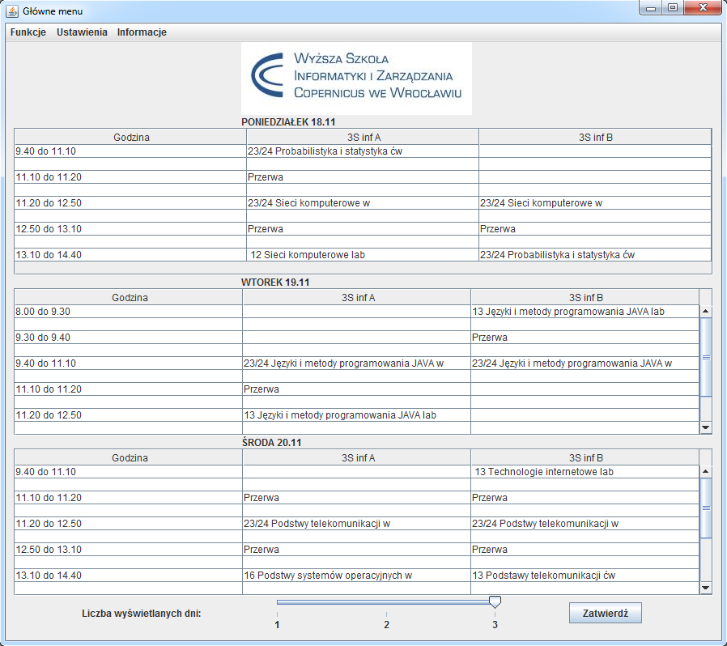
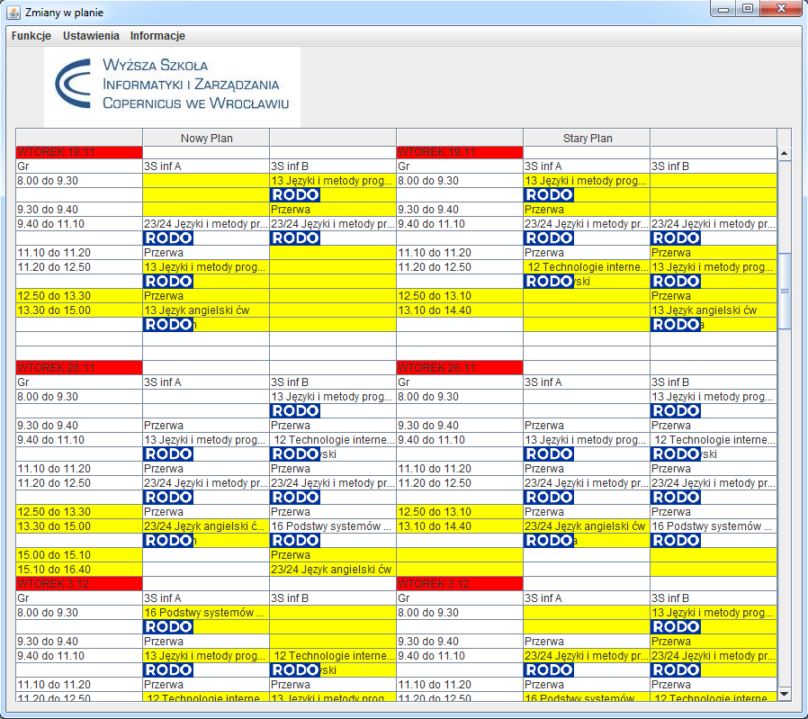

# Plan WSIZ App
Aplikacja operuje planem zajęć studiów stacjonarnych WSIZ Wroc.

## Zewnętrzne biblioteki
* **Apache POI** `https://poi.apache.org/`

## Zakresy danych
>**Numer semestru** od 1 do 7  
>**Ilość wyświetlanych dni** od 1 do 3  
>**Grupa** od A do Z  
>**Nazwa przedmiotu** frazy w dowlonej kolejności oddzielone spacją  
>**Numer powtórzenia** od 1 do ∞

## Funkcje
* pobiera najnowszy plan zajęć ze strony `https://www.wsiz.wroc.pl/plany-zajec/` w przypadku, gdy takiego nie posiadamy w folderze z aplikacją
* usuwa wszystkie przedawnione pliki z planami zajęć (z wyjątkiem wcześniej aktualnego)
* **Plan na najbliższe dni** wyświetla plan zajęć na wybraną przez nas liczbę najbliższych dni
* **Plan z podanego dnia**  wyświetla zajęcia na najbliższe dni od podanej daty (ilość wybrana przez użytkownika)
* **Zmiany w planie** porównuje wszystkie dni, w których nastąpiły zmiany w stosunku do wcześniej zapisanego planu lekcji, zaznaczając przy tym kolumny, które uległy modyfikacji
* **Wyszukaj zajęcia numer X** wyszukuje i wyświetla plan całego dnia, na który przypada podane z kolei powtórzenie wszystkich fraz w jednej kolumnie dla danej grupy (jeśli podany semestr posiada więcej niż jedną grupę)

